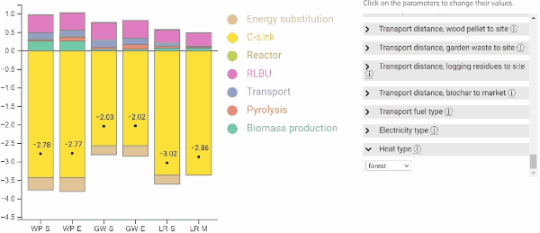

# bw2-widget

 Convert a simple parametrized bw2 model to an interactive javascript widget, for simple inclusion in a website or visualisation in a standalone html file.

The widgets are meant to provide interactive visualisation of LCA results and the influence of the parameters to stakeholders, but should not be used to 'perform' an LCA study.

## Dependencies & assumptions on bw2 project

Package dependencies, mainly: 
- brightway2 https://github.com/brightway-lca/brightway2 
- lca_algebraic https://github.com/oie-mines-paristech/lca_algebraic
- activity-browser https://github.com/LCA-ActivityBrowser/activity-browser 
(not tested for more recent versions, but can work or can be adapted to work)

HTML visualisation depend on:
- d3js v6 or v7 (compatible with both, as far as I checked)

Available charts:
- waterfall chart, updated from https://github.com/pjamesjoyce/lcopt
- stacked bar chart

## Workflow

### Step 1: export bw2 model to js file

### Step 2: visualise in html browser

### a. Standalone html file

### b. Inclusion in hugo website, via shortcode

## Folder structure

## Contributions
- new plot types, in d3js 
- option for multiple impact categories
- add sobol-simplified models
- add parameter order (custom or by importance)
- shift from .js file to a .json file export
...